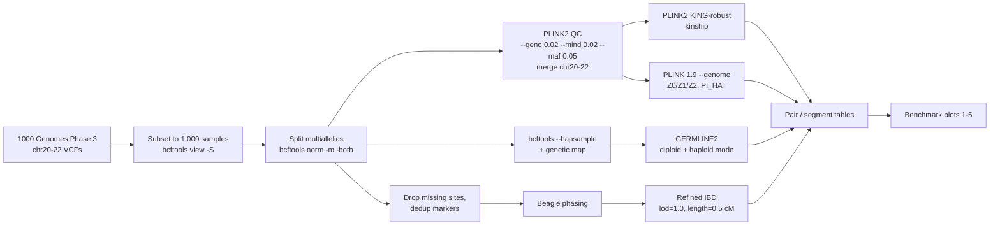
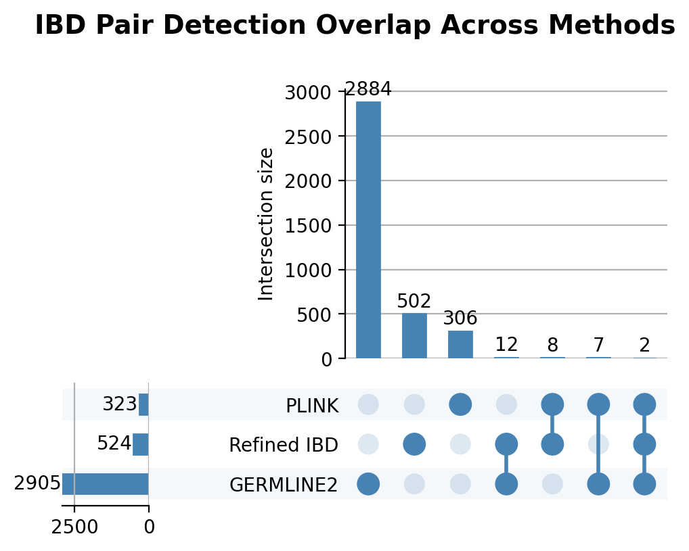
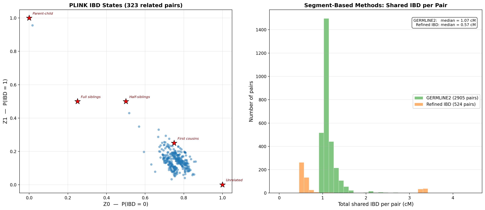
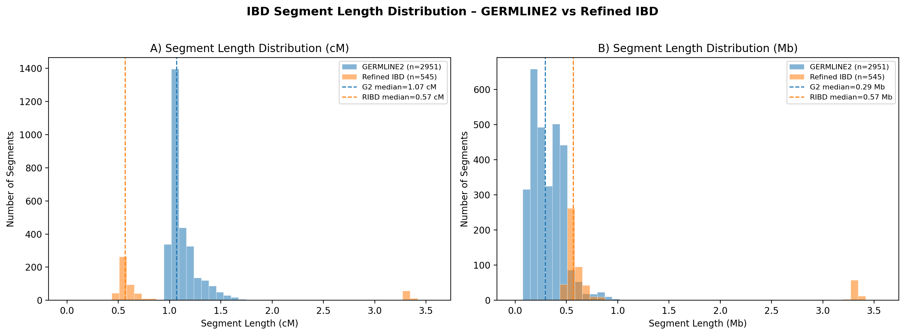
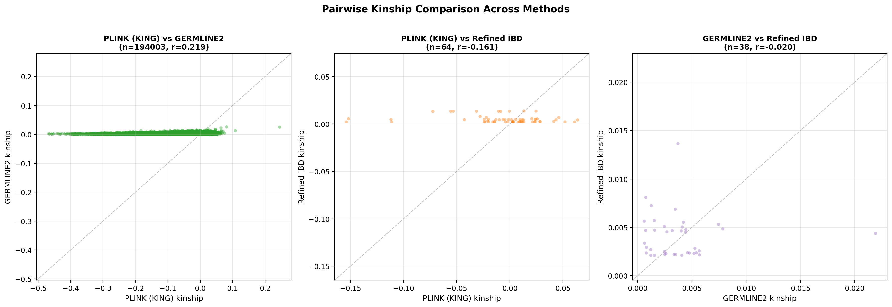
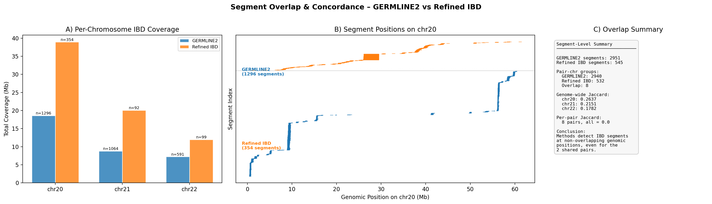

# IBD Relative-Finding Benchmark

**Benchmarking three identity-by-descent (IBD) detection approaches for relative finding (PLINK KING / `--genome`, GERMLINE2, and Beagle + Refined IBD) on 1,000 individuals from 1000 Genomes Phase 3.**

---

## Overview

Two people who share long stretches of DNA inherited from a common ancestor share it *identical by descent* (IBD). Relative-finding services, pedigree reconstruction, cohort QC in GWAS (removing cryptic relatives) and IBD-based association mapping all depend on detecting this sharing. The methods do it in very different ways:

| Approach | Tool | Input | Output |
|---|---|---|---|
| Genotype-based moment estimators | **PLINK2 KING-robust**, **PLINK 1.9 `--genome`** | Unphased genotypes | Per-pair kinship, $Z_0/Z_1/Z_2$, $\hat\pi$ (PI_HAT) |
| Hash-and-extend haplotype matching | **GERMLINE2** | Phased haplotypes + genetic map | IBD segments (bp, cM) |
| Probabilistic haplotype IBD | **Beagle 5 + Refined IBD** | Phased haplotypes (Beagle) | IBD segments with LOD scores |

This project runs all three on the **same cohort and the same variants** and compares what they report: how many pairs each calls related, how much those pair sets overlap, segment-length distributions, kinship agreement, and segment-level genomic concordance.

## What we built

- A **reproducible end-to-end pipeline** from raw 1000 Genomes VCFs to pair- and segment-level IBD calls: download, a fixed 1,000-sample cohort (`data_raw/final_samples_1000.txt`), `bcftools` subsetting and biallelic normalization, PLINK2 QC, cross-chromosome merge, and one driver script per method.
- **Three IBD methods** run on chromosomes 20–22, with post-processing that turns raw segment calls into comparable pair-level tables (segment counts, total shared cM, and IBD0/1/2 probabilities and a kinship proxy derived from the segments).
- A **cross-method benchmarking suite**: five plotting scripts that measure pair-set overlap (UpSet), PLINK IBD-state structure vs. segment-based shared cM, segment-length distributions, kinship correlation, and base-pair Jaccard concordance of segment coverage.
- **Sanity checks**: expected counts for each stage, so a re-run can be verified against the reference outputs.

### My contributions (Sergi Marsol)

From the project's git history:
- Built the data-processing / QC pipeline and the fixed 1,000-sample cohort (`scripts/run_3chr_1000.sh`, `data_raw/` sample lists, `.gitignore`).
- Ran **PLINK2 KING** and **PLINK 1.9 `--genome`** and produced the related-pair list (`results/relatives_detected.txt`).
- Wrote **all five cross-method benchmarking scripts and figures** (`scripts/plot1_…plot5_*.py`, `plots/`).
- Restructured the documentation into a reviewer run guide and cleaned up legacy outputs.

Teammates: **Lillian Liu** led GERMLINE2 (input conversion, genetic maps, `analyze_germline2.py`, `germline2_kinship.py`, runtime profiling). **Sehaj Dhillon** led Beagle + Refined IBD (`run_3chr_1000_ibd.sh`, `analyze_refinedibd.py`).

## Methods



**Data.** 1000 Genomes Phase 3 v5b (`ALL.chr{20,21,22}.phase3_shapeit2_mvncall_integrated_v5b.20130502.genotypes.vcf.gz`), 1,000 individuals sampled from the full integrated panel (all populations), chromosomes 20, 21 and 22 only to keep compute manageable.

**PLINK.** After QC, KING-robust kinship $\phi$ is computed for all $\binom{1000}{2} = 499{,}500$ pairs. A pair is called related if $\phi > 0.0442$ (3rd degree or closer). Standard bins: 1st degree $> 0.177$, 2nd degree $0.0884$–$0.177$, 3rd degree $0.0442$–$0.0884$. `--genome` gives the method-of-moments IBD-state probabilities $Z_0, Z_1, Z_2$ and $\hat\pi = Z_1/2 + Z_2$.

**GERMLINE2.** Haplotypes from `bcftools convert --hapsample` with per-chromosome genetic maps (`data_raw/chr*_g2.map`). Run in diploid and haploid (`-h`) mode with `-m 1.0 -g 2 -d 0 -f 0.05` (1 cM minimum segment length).

**Refined IBD.** Missing-genotype sites and duplicate markers removed, phased with Beagle (`beagle.27Feb25.75f.jar`), then Refined IBD (`refined-ibd.17Jan20.102.jar`) with permissive thresholds (`lod=1.0`, `length=0.5`) to capture short segments on small chromosomes.

**Segment to pair metrics.** For segment-based methods, segments are aggregated per pair into total shared cM and covered fractions, from which $P(\text{IBD}=0,1,2)$ and a kinship proxy $\phi = P_{\text{IBD1}}/4 + P_{\text{IBD2}}/2$ are derived (`pairwise_ibd012.csv`).

**Benchmark metrics.** Pair-set overlap (UpSet), Pearson $r$ between kinship estimates on shared pairs, segment-length distributions (cM and Mb), and per-chromosome base-pair Jaccard of segment coverage, $J = |A \cap B| / |A \cup B|$, plus per-pair Jaccard for pairs both segment methods detect.

## Results

All numbers below come from files in `results/` and the figures in `plots/`.

**Cohort and QC.** 1,000 samples, none removed by `--mind 0.02`; 401,845 biallelic SNPs after QC across chr20–22 (PLINK log, project history). 499,500 pairs were evaluated.

**Pairs called related / with shared IBD**

| Method | Pairs | Segments | Source |
|---|---:|---:|---|
| PLINK KING ($\phi > 0.0442$) | **323** (1st: 1, 2nd: 1, 3rd: 321) | n/a | `results/relatives_detected.txt` |
| GERMLINE2 (any segment ≥ 1 cM) | **2,905** | **2,951** (chr20: 1,296, chr21: 1,064, chr22: 591) | `plots/plot1`, `plots/plot3`, `results/GERMLINE2/chr*_1000_g2_out` |
| Refined IBD (any segment) | **524** | **545** (chr20: 354, chr21: 92, chr22: 99) | `results/refinedibd_3chr_pairwise_summary.tsv`, `results/refinedibd_segment_counts.txt` |

**Strongest relationship.** The top KING pair is **NA20320 and NA20321** ($\phi = 0.2446$, the only 1st-degree pair). `--genome` puts it at PI_HAT ≈ 0.5049 with $Z_1$ close to 1, the parent–child signature (see the isolated point near $(Z_0, Z_1) = (0, 1)$ in plot 2).

### 1. Pair-set overlap: the methods disagree



Only **2 pairs** are detected by all three methods. Most calls are method-specific: 2,884 GERMLINE2-only, 502 Refined-IBD-only and 306 PLINK-only pairs. Pairwise intersections are small (GERMLINE2 ∩ Refined IBD only: 12; PLINK ∩ Refined IBD only: 8; PLINK ∩ GERMLINE2 only: 7).

### 2. PLINK IBD states vs. segment-based shared cM



Most of the 323 KING-related pairs sit around $Z_0 \approx 0.7$–$0.85$, $Z_1 \approx 0.05$–$0.3$, well away from the parent–child and sibling expectations. With only three short chromosomes and a multi-population cohort, this pattern fits weak, distant relatedness and population-structure effects better than true close kinship. Median total shared IBD per pair is **1.07 cM (GERMLINE2)** vs **0.57 cM (Refined IBD)**.

### 3. Segment lengths



Median segment length: GERMLINE2 **1.07 cM / 0.29 Mb**, Refined IBD **0.57 cM / 0.57 Mb**. The difference follows the minimum-length settings (1 cM for GERMLINE2, 0.5 cM for Refined IBD). Refined IBD also has a small cluster of segments around 3.3 cM.

### 4. Kinship agreement



Pearson correlation of kinship estimates on shared pairs: PLINK KING vs GERMLINE2 **r = 0.219** (n = 194,003); KING vs Refined IBD **r = −0.161** (n = 64); GERMLINE2 vs Refined IBD **r = −0.020** (n = 38).

### 5. Segment-level concordance



Per-chromosome base-pair Jaccard of segment coverage between GERMLINE2 and Refined IBD: **chr20 0.2637, chr21 0.2151, chr22 0.1782**. Only **8** (pair, chromosome) groups out of 2,940 (GERMLINE2) and 532 (Refined IBD) are shared, and **every one of them has per-pair Jaccard = 0.0**. When both methods flag the same pair, they place the segments at non-overlapping positions.

### Compute (GERMLINE2)

From `results/GERMLINE2/runtime_summary.csv`: wall time per chromosome was 3:03–5:08 (diploid) and 3:23–5:55 (haploid), with peak memory 30.7 MB (diploid) and 59.1 MB (haploid).

### Takeaway

At this scale (1,000 mostly unrelated individuals, 3 small chromosomes), all three methods find the single first-degree pair, but their sets of distant "relatives" barely overlap and their segment calls do not agree on position. This shows how sensitive short-segment IBD calling is to the algorithm and its thresholds. Calls below a few cM on limited genome length are not reliable evidence of relatedness on their own.

Additional per-method diagnostics are in `results/GERMLINE2/*.png` and `results/chr*_refined_IBD/*.png`.

## Tech stack

`bcftools` · PLINK2 · PLINK 1.9 · GERMLINE2 · Beagle 5 · Refined IBD (Java) · Bash · Python (pandas, NumPy, matplotlib, UpSetPlot)

## Repository structure

```text
data_raw/                    sample lists, GERMLINE2 .samples/.map files, CEU recombination maps
scripts/
  run_3chr_1000.sh           download + QC + PLINK KING + --genome
  run_3chr_1000_ibd.sh       QC + Beagle phasing + Refined IBD
  analyze_germline2.py       GERMLINE2 segment -> pair-level tables, runtime summary
  analyze_refinedibd.py      Refined IBD segment -> pair-level tables
  germline2_kinship.py       kinship-based relationship classification (GERMLINE2)
  plot1_upset_overlap.py … plot5_jaccard.py   cross-method benchmark figures
results/
  relatives_detected.txt     KING pairs with kinship > 0.0442
  refinedibd_*.ibd.gz, refinedibd_3chr_pairwise_summary.tsv, refinedibd_segment_counts.txt
  chr2{0,1,2}_refined_IBD/   per-chromosome Refined IBD summaries
  GERMLINE2/                 segment calls, runtime + segment summaries, diagnostic plots
plots/                       benchmark figures 1–5
```

> **Regenerated outputs.** Large raw outputs are not committed and are produced by the scripts: `results/king_3chr_1000.kin0`, `results/genome_3chr_1000.genome` (PLINK, about 500k rows each), `results/GERMLINE2/pairwise_ibd*.csv` (GERMLINE2 post-processing), plus the VCFs and `data_qc/` intermediates. Plots 1, 2 and 4 need these files, so run the pipelines below first.

## Getting started

### 1. Dependencies

Command-line tools: `bcftools`, `plink2`, `plink` (1.9), `wget`, Java, and:
- GERMLINE2 (`g2`): https://github.com/gusevlab/germline2
- Beagle jar `beagle.27Feb25.75f.jar` and Refined IBD jar `refined-ibd.17Jan20.102.jar`, placed in the project root (same level as `scripts/`)

Python:

```bash
python3 -m pip install -r requirements.txt
```

### 2. PLINK (KING + `--genome`)

```bash
bash scripts/run_3chr_1000.sh
```

Downloads chr20/21/22 VCFs and the panel if missing, reuses `data_raw/final_samples_1000.txt`, subsets and normalizes, runs QC and merging, then KING and `--genome`. Outputs: `results/king_3chr_1000.kin0`, `results/genome_3chr_1000.genome`, `results/relatives_detected.txt`.

```bash
awk 'NR>1 && $8>0.0442{n++} END{print n+0}' results/king_3chr_1000.kin0   # expected: 323
grep -E 'NA20320.*NA20321|NA20321.*NA20320' results/genome_3chr_1000.genome  # PI_HAT ~0.5049
```

### 3. GERMLINE2

Prepare inputs (needs the subset VCFs `data_raw/chr{20,21,22}_1000.vcf.gz`):

```bash
for chr in 20 21 22; do
  bcftools convert --hapsample data_raw/chr${chr}_1000_g2 data_raw/chr${chr}_1000.vcf.gz
  gunzip -f data_raw/chr${chr}_1000_g2.hap.gz
done
```

Run diploid and haploid mode:

```bash
for chr in 20 21 22; do
  g2 -m 1.0 -g 2 -d 0 -f 0.05 \
    data_raw/chr${chr}_1000_g2.hap data_raw/chr${chr}_1000_g2.samples \
    data_raw/chr${chr}_g2.map results/GERMLINE2/chr${chr}_1000_g2_out
  g2 -h -m 1.0 -g 2 -d 0 -f 0.05 \
    data_raw/chr${chr}_1000_g2.hap data_raw/chr${chr}_1000_g2.samples \
    data_raw/chr${chr}_g2.map results/GERMLINE2/chr${chr}_1000_g2_out_hap
done
```

Post-process into pair-level tables:

```bash
python3 scripts/analyze_germline2.py \
  --prefix results/GERMLINE2/chr20_1000_g2_out \
  --prefix results/GERMLINE2/chr21_1000_g2_out \
  --prefix results/GERMLINE2/chr22_1000_g2_out \
  --hap_prefix results/GERMLINE2/chr20_1000_g2_out_hap \
  --hap_prefix results/GERMLINE2/chr21_1000_g2_out_hap \
  --hap_prefix results/GERMLINE2/chr22_1000_g2_out_hap \
  --map data_raw/chr20_g2.map \
  --map data_raw/chr21_g2.map \
  --map data_raw/chr22_g2.map \
  --sample data_raw/chr22_1000_g2.samples \
  --outdir results/GERMLINE2
```

```bash
awk 'END{print NR-1}' results/GERMLINE2/pairwise_ibd.csv   # expected: 2905
cat results/GERMLINE2/chr*_1000_g2_out | wc -l             # expected: 2951
```

### 4. Beagle + Refined IBD

```bash
bash scripts/run_3chr_1000_ibd.sh
```

```bash
awk 'END{print NR-1}' results/refinedibd_3chr_pairwise_summary.tsv   # expected: 524
gzip -dc results/refinedibd_3chr_all.ibd.gz | wc -l                  # expected: 545
# every sample must come from final_samples_1000.txt (expected: 0)
comm -23 <(gzip -dc results/refinedibd_3chr_all.ibd.gz | awk '{print $1; print $3}' | sort -u) <(sort data_raw/final_samples_1000.txt) | wc -l
```

### 5. Benchmark figures

```bash
python3 scripts/plot1_upset_overlap.py
python3 scripts/plot2_z0_z1_scatter.py
python3 scripts/plot3_segment_length.py
python3 scripts/plot4_kinship_scatter.py
python3 scripts/plot5_jaccard.py
```

Figures are written to `plots/plot{1..5}_*.png`. A run matches the reference outputs if it uses `final_samples_1000.txt` (not a newly randomized cohort) and reproduces the counts 323 / 2,905 / 524 / 545 above.

## Team & acknowledgements

- **Sehaj Dhillon**: Beagle phasing and Refined IBD pipeline and analysis
- **Lillian Liu**: GERMLINE2 pipeline, genetic maps, analysis and runtime profiling
- **Sergi Marsol**: data/QC pipeline, PLINK KING and `--genome`, cross-method benchmarking figures, documentation

Developed at UC San Diego (CSE 284, Bioinformatics, Winter 2026). Data from the [1000 Genomes Project](https://www.internationalgenome.org/) Phase 3 release. Tools: PLINK, bcftools, GERMLINE2 (Gusev lab), Beagle and Refined IBD (B. Browning).

## License

MIT. See [LICENSE](LICENSE). Third-party data and tools keep their own licenses and terms.
